# Output Gallery

| 01. Image | 02. Background |
| :---: | :---: |
| 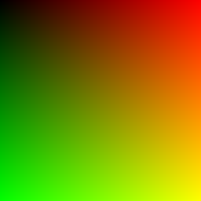 |  |

| 03. A Sphere | 04. Normal Surface |
| :---: | :---: |
| 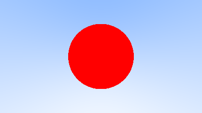 | 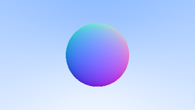 |

| 05. Multiple Objects | 06. Antialiasing |
| :---: | :---: |
| 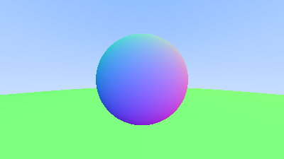 |  |

| 07. Diffuse Material | 08. Gamma Correction |
| :---: | :---: |
| 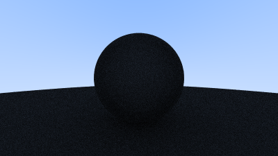 | 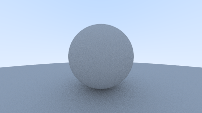 |

| 09. Metal | 10. Dielectric |
| :---: | :---: |
| 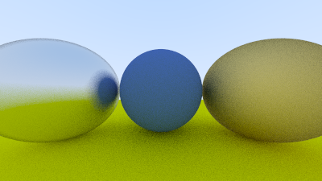 | 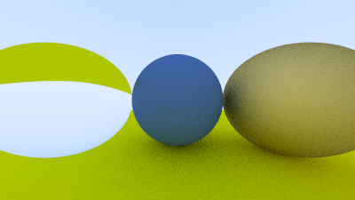 |

| 11. Total Internal Reflection | 12. Hollow Glass Sphere |
| :---: | :---: |
| 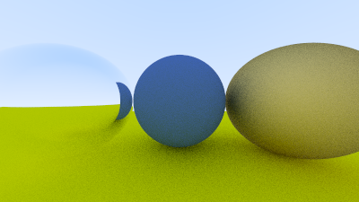 | 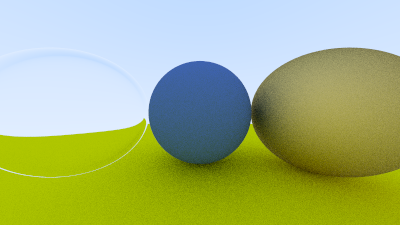 |

| 13. Vertical Field of View | 14. Positionable Camera |
| :---: | :---: |
| 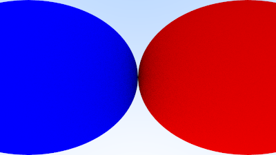 | 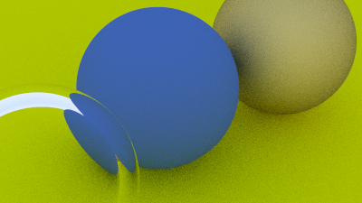 |

| 15. Defocus Blur |
| :---: |
| 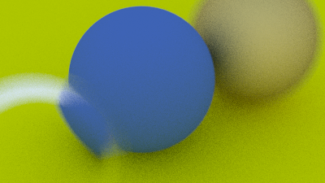 |

| 16. Final Render |
| :---: |
| 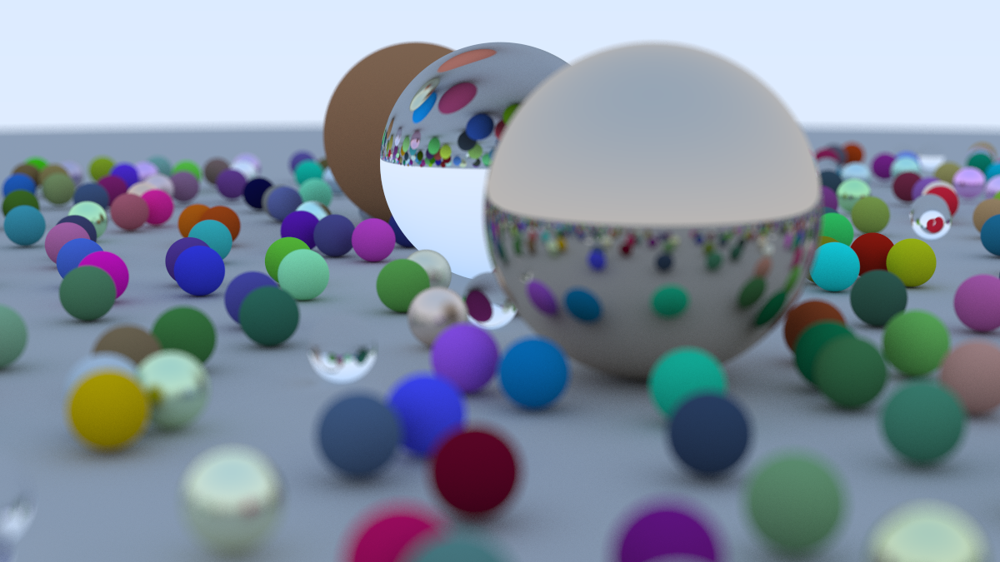 |

## Happy Accidents

[사고 기록 자세히 보기](./happy-accidents/README.md)

| 01. Accidental Pastel Eclipse | 02. Accidental Sphere Fusion |
| :---: | :---: |
|  |  |

| 03. Split-Brain Camera | 04. Defocus Fever Dream |
| :---: | :---: |
|  | [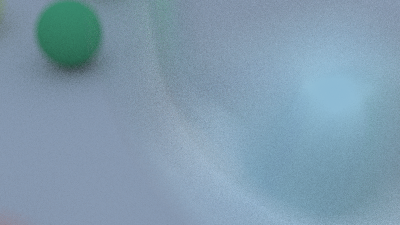](./happy-accidents/README.md) |
