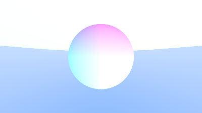
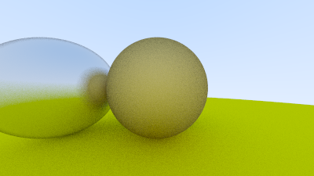
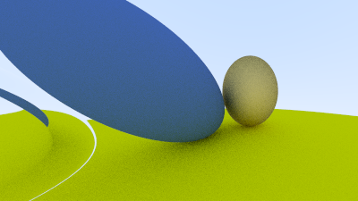

# Happy Accidents

사고 기록

## 01. Accidental Pastel Eclipse



- 생성일: 2026-09-27
- 해상도: 400 × 225
- 원본 포맷: P3 PPM
- 파일: [PNG](./01_Accidental_Pastel_Eclipse.png) / [PPM](./01_Accidental_Pastel_Eclipse.ppm)

안티 앨리어싱 구현 중, 계산 실수로 우연히 만들어진 이미지.

### 문제와 원인

**요약**

1. viewport 방향을 반대로 잡아서 화면이 상하로 뒤집혔다.
2. normal 색 계산에서 괄호를 잘못 쳐서 밝은 부분이 하얗게 날아갔다.

#### 1. 화면의 Y축 반전

```cpp
// 사고 현장
auto viewportV = Vec3(0.0, viewportHeight, 0.0);

// 원래 의도
auto viewportV = Vec3(0.0, -viewportHeight, 0.0);
```

이미지의 행 번호는 위에서 아래로 커지지만, 월드 좌표계에서는 위쪽이 +Y다.

그래서 `viewportV`의 Y 성분은 음수여야 하지만 Y 성분을 양수로 적어버려서 이미지가 위아래로 뒤집혔다.

#### 2. 법선 색상의 과노출

```cpp
// 사고 현장
return (0.5 * (hitRecord.Normal) + Color(1.0, 1.0, 1.0));

// 원래 의도
return 0.5 * ((hitRecord.Normal) + Color(1.0, 1.0, 1.0));
```

전체에 0.5를 곱해야 했는데, `normal`에만 곱해버렸다.

의도한 식은 법선 성분 `[-1, 1]`을 색상 `[0, 1]`로 옮긴다.

실제로 쓴 식은 `[0.5, 1.5]`를 만들었고, 1보다 큰 값이 `clamp`되면서 밝은 색이 하얗게 날아갔다.

## 02. Accidental Sphere Fusion



- 생성일: 2026-09-28
- 해상도: 400 × 225
- 원본 포맷: P3 PPM
- 파일: [PNG](./02_Accidental_Sphere_Fusion.png) / [PPM](./02_Accidental_Sphere_Fusion.ppm)

금속 구를 추가하다가 중앙 구와 오른쪽 구가 겹쳐버렸다.

### 문제와 원인

```cpp
// 사고 현장
world.Add(std::make_shared<Sphere>(Point3(0.0, 0.0, -1.2), 0.5, materialCenter));
world.Add(std::make_shared<Sphere>(Point3(0.0, 0.0, -1.0), 0.5, materalRight));

// 원래 의도
world.Add(std::make_shared<Sphere>(Point3(1.0, 0.0, -1.0), 0.5, materalRight));
```

두 구의 X와 Y 좌표가 같고, Z축으로도 `0.2`밖에 떨어져 있지 않는 탓에 오른쪽 금속 구가 중앙 구와 겹쳐져 버렸다.

## 03. Split-Brain Camera



- 생성일: 2026-09-28
- 해상도: 400 × 225
- 원본 포맷: P3 PPM
- 파일: [PNG](./03_Split_Brain_Camera.png) / [PPM](./03_Split_Brain_Camera.ppm)

카메라 이동을 구현하던 중, 예전 카메라 계산을 일부 남겨둬서 만들어진 이미지.

### 문제와 원인

Camera.Initialize 에서 초기화 문제가 있었다

#### 1. ray의 출발점 초기화 문제

```cpp
// 사고 현장
mCenter = Point3(0.0, 0.0, 0.0);

// 원래 의도
mCenter = Lookfrom;
```

`GetRay()`는 `mCenter`를 광선의 출발점으로 사용하기 때문에, `Lookfrom`을 바꿔도 실제 광선은 계속 원점에서 출발했다.

#### 2. 서로 다른 기준으로 계산한 viewport

```cpp
// 사고 현장
auto viewportUpperLeft =
    mCenter - Vec3(0.0, 0.0, focalLength)
    - viewportU / 2.0
    - viewportV / 2.0;

// 원래 의도
auto viewportUpperLeft =
    mCenter - (focalLength * w)
    - viewportU / 2.0
    - viewportV / 2.0;
```

viewport의 가로와 세로는 새 카메라 축인 `u`, `v`로 계산했지만, 중심은 월드 좌표의 `-Z` 방향에 놓아져 있었기 때문에 방향과 위치의 기준이 서로 달라졌다.
